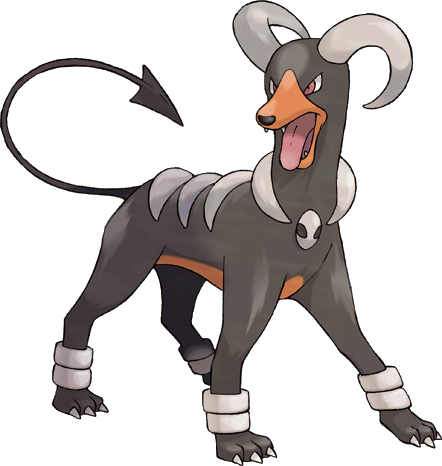

```{r setup, include=FALSE}
knitr::opts_chunk$set(echo = TRUE, message = FALSE,
                      warning = FALSE)
```

## Tree-Based Models

For this assignment, we will continue working with the file `"pokemon.csv"`, found in `/data`. The file is from Kaggle: <https://www.kaggle.com/abcsds/pokemon>.

The [Pokémon](https://www.pokemon.com/us/) franchise encompasses video games, TV shows, movies, books, and a card game. This data set was drawn from the video game series and contains statistics about 721 Pokémon, or "pocket monsters." In Pokémon games, the user plays as a trainer who collects, trades, and battles Pokémon to (a) collect all the Pokémon and (b) become the champion Pokémon trainer.

Each Pokémon has a [primary type](https://bulbapedia.bulbagarden.net/wiki/Type) (some even have secondary types). Based on their type, a Pokémon is strong against some types, and vulnerable to others. (Think rock, paper, scissors.) A Fire-type Pokémon, for example, is vulnerable to Water-type Pokémon, but strong against Grass-type.

{width="200"}

The goal of this assignment is to build a statistical learning model that can predict the **primary type** of a Pokémon based on its generation, legendary status, and six battle statistics.

**Note: Fitting ensemble tree-based models can take a little while to run. Consider running your models outside of the .Rmd, storing the results, and loading them in your .Rmd to minimize time to knit.**

```{r}
library(tidymodels)
library(tidyverse)

library(ISLR) # For the Smarket data set
library(ISLR2) # For the Bikeshare data set
library(klaR) # for naive bayes

library(discrim)
library(poissonreg)
library(corrr)
library(forcats)
library(corrplot)
library(pROC)
library(recipes)
library(rsample)
library(parsnip)
library(workflows)
library(janitor)
library(glmnet)
library(rpart.plot)
library(vip)
library(janitor)
library(randomForest)
library(xgboost)
tidymodels_prefer()
```

### Exercise 1

Read in the data and set things up as in Homework 5:

- Use `clean_names()`
- Filter out the rarer Pokémon types
- Convert `type_1` and `legendary` to factors

Do an initial split of the data; you can choose the percentage for splitting. Stratify on the outcome variable.

Fold the training set using *v*-fold cross-validation, with `v = 5`. Stratify on the outcome variable.

Set up a recipe to predict `type_1` with `legendary`, `generation`, `sp_atk`, `attack`, `speed`, `defense`, `hp`, and `sp_def`:

- Dummy-code `legendary` and `generation`;
- Center and scale all predictors.

```{r}
# read dataset
pokemon_raw <- read.csv("Pokemon.csv") 

# clean_name()
pokemon1 <- clean_names(pokemon_raw)

# filter out rarer
pokemon <- pokemon1[which(pokemon1$type_1 == "Bug"| pokemon1$type_1 =="Fire"|
                     pokemon1$type_1 =="Grass"| pokemon1$type_1 =="Normal"| 
                     pokemon1$type_1 =="Water"| pokemon1$type_1 =="Psychic"), ]

# convert factors
pokemon <- pokemon %>% 
              mutate(type_1 = factor(type_1), 
                  legendary =factor(legendary))

# initial split
set.seed(2022)
pokemon_split <- pokemon %>% 
  initial_split(strata = type_1, prop = 0.7)
pokemon_train <- training(pokemon_split)
pokemon_test <- testing(pokemon_split)

# set up cross-validation
pokemon_fold <- vfold_cv(pokemon_train, v = 5, strata = type_1)

# set up recipe
pokemon_recipe <- recipe(type_1 ~ legendary + generation + sp_atk + 
                         attack + speed + defense + hp + sp_def, pokemon_train) %>% 
  step_dummy(legendary,generation) %>% 
  step_center(all_predictors()) %>%
  step_scale(all_predictors())

```

### Exercise 2

Create a correlation matrix of the training set, using the `corrplot` package. *Note: You can choose how to handle the continuous variables for this plot; justify your decision(s).*

What relationships, if any, do you notice? Do these relationships make sense to you?

```{r}
pokemon_train %>% 
  select(where(is.numeric), -x,-generation) %>% 
  cor(use = "complete.obs") %>% 
  corrplot(type = "lower", diag = FALSE)  
```

\
*I remove variable x and generation since x is index and generation is not continuous.*\
*Almost all the variables have positive relationship to other, especially, all variables are high positive relate to total which make sense to me that the higher variable a pokemon has the more stronger pokemon is.*

### Exercise 3

First, set up a decision tree model and workflow. Tune the `cost_complexity` hyperparameter. Use the same levels we used in Lab 7 -- that is, `range = c(-3, -1)`. Specify that the metric we want to optimize is `roc_auc`. 

Print an `autoplot()` of the results. What do you observe? Does a single decision tree perform better with a smaller or larger complexity penalty?

```{r}
# set up model and workflow
tree_spec <- decision_tree() %>%
  set_engine("rpart")

class_tree_spec <- tree_spec %>%
  set_mode("classification")

class_tree_wf <- workflow() %>%
  add_recipe(pokemon_recipe) %>%
  add_model(class_tree_spec %>% 
  set_args(cost_complexity = tune())) 
 

param_grid <- grid_regular(cost_complexity(range = c(-3, -1)), levels = 10)

tune_res <- tune_grid(
  class_tree_wf, 
  resamples = pokemon_fold, 
  grid = param_grid, 
  metrics = metric_set(roc_auc)
)

# print results
autoplot(tune_res)

```

\
*The roc_auc stays around 0.615 and doesn't change a lot with the increasing of parameter, and reaches the peak  around 0.02 of the parameter value. After that, the roc_auc starts dropping rapidly after around 0.075 of the parameter value.*\
*So, we can see that a single decision tree perform better with a larger complexity penalty.*

### Exercise 4

What is the `roc_auc` of your best-performing pruned decision tree on the folds? *Hint: Use `collect_metrics()` and `arrange()`.*

```{r}
arrange(collect_metrics(tune_res),desc(mean))

```

\
*0.629 roc_auc along with 0.0215 parameter is the best model.*


### Exercise 5

Using `rpart.plot`, fit and visualize your best-performing pruned decision tree with the *training* set.

```{r}
best_complexity <- select_best(tune_res)

class_tree_final <- finalize_workflow(class_tree_wf, best_complexity)

class_tree_final_fit <- fit(class_tree_final, data = pokemon_train)

class_tree_final_fit %>%
  extract_fit_engine() %>%
  rpart.plot()

```

### Exercise 5

Now set up a random forest model and workflow. Use the `ranger` engine and set `importance = "impurity"`. Tune `mtry`, `trees`, and `min_n`. Using the documentation for `rand_forest()`, explain in your own words what each of these hyperparameters represent.

Create a regular grid with 8 levels each. You can choose plausible ranges for each hyperparameter. Note that `mtry` should not be smaller than 1 or larger than 8. **Explain why not. What type of model would `mtry = 8` represent?**

```{r}

rf_spec <- rand_forest(mtry = tune(),trees = tune(), min_n = tune()) %>%
  set_engine("ranger", importance = "impurity") %>%
  set_mode("classification")

rf_wf <- workflow() %>%
  add_model(rf_spec) %>% 
  add_recipe(pokemon_recipe)

param_grid2 <- grid_regular(mtry(range = c(1, 8)),
                           trees(range = c(10, 1000)),
                           min_n(range = c(1, 8)),
                           levels = 8)

```

* mtry: The number of predictors will be randomly sampled with each split of tree models. 
* trees: The number of trees in the ensemble tree models.
* min_n: The minimum number of data points in a node that is required to make a split.

_mtry should not be smaller than 1 or larger than 8 since we only have 8 predictors._\
_If we set mtry = 8, it will represent the bagging model._


### Exercise 6

Specify `roc_auc` as a metric. Tune the model and print an `autoplot()` of the results. What do you observe? What values of the hyperparameters seem to yield the best performance?

```{r}
tune_res <- tune_grid(
  rf_wf, 
  resamples = pokemon_fold, 
  grid = param_grid2, 
  metrics = metric_set(roc_auc)
)

# print results
autoplot(tune_res)
```

\
*The best model's roc_auc is 0.747 which contains 2 mtry, 575 trees,and 4 min_n.*\
*In general, The more trees we add the better performance we have, and the roc_auc and the number of predictors are negatively relative.*

### Exercise 7

What is the `roc_auc` of your best-performing random forest model on the folds? *Hint: Use `collect_metrics()` and `arrange()`.*

```{r}
arrange(collect_metrics(tune_res),desc(mean))
```

*The best model's roc_auc is 0.747 which contains 2 mtry, 575 trees,and 4 min_n.*

### Exercise 8

Create a variable importance plot, using `vip()`, with your best-performing random forest model fit on the *training* set.

Which variables were most useful? Which were least useful? Are these results what you expected, or not?

```{r}
best_complexity <- select_best(tune_res, metric = "roc_auc")
pokemon_final <- finalize_workflow(rf_wf, best_complexity)
rf_fit <- fit(pokemon_final,data = pokemon_train)
rf_fit %>%
  extract_fit_engine() %>%
  vip()
```

\
*The most useful variable is sp_atk and the least useful variable is legendary_True, I'm so surprise that the sp_atk is the most useful variable, and the other variables are under my consideration.*

### Exercise 9

Finally, set up a boosted tree model and workflow. Use the `xgboost` engine. Tune `trees`. Create a regular grid with 10 levels; let `trees` range from 10 to 2000. Specify `roc_auc` and again print an `autoplot()` of the results. 

What do you observe?

What is the `roc_auc` of your best-performing boosted tree model on the folds? *Hint: Use `collect_metrics()` and `arrange()`.*

```{r}
boost_tree_spec <- boost_tree(trees = tune()) %>%
  set_engine("xgboost") %>%
  set_mode("classification")

boost_tree_grid <- grid_regular(trees(c(10,2000)),levels = 10)

boost_tree_wf <- workflow() %>%
  add_model(boost_tree_spec) %>%
  add_formula(type_1 ~ sp_atk + attack + speed + 
                defense + hp + sp_def + legendary + generation)

boost_tune_res <- tune_grid(
  boost_tree_wf, 
  resamples = pokemon_fold, 
  grid = boost_tree_grid, 
  metrics = metric_set(roc_auc),
)
 
autoplot(boost_tune_res)
```

*The rou_auc keeps increasing until around 250 and starts decreasing while the trees number is increasing.*

```{r}
arrange(collect_metrics(boost_tune_res),desc(mean))
```

*The best model is the one that has 0.728 roc_auc and 231 trees.*

### Exercise 10

Display a table of the three ROC AUC values for your best-performing pruned tree, random forest, and boosted tree models. Which performed best on the folds? Select the best of the three and use `select_best()`, `finalize_workflow()`, and `fit()` to fit it to the *testing* set. 

```{r}
best_boost_tree <- select_best(boost_tune_res)
boost_tree_final <- finalize_workflow(boost_tree_wf, best_boost_tree)
boost_tree_final_fit <- fit(boost_tree_final, data = pokemon_train)
```


```{r}
final_class_model = augment(class_tree_final_fit, new_data = pokemon_train)
final_rand_model = augment(rf_fit, new_data = pokemon_train)
final_boost_model = augment(boost_tree_final_fit, new_data = pokemon_train)
results<- bind_rows(
  roc_auc(final_class_model, truth = type_1, .pred_Bug, .pred_Fire, .pred_Grass, 
          .pred_Normal, .pred_Water, .pred_Psychic),
  roc_auc(final_rand_model, truth = type_1, .pred_Bug, .pred_Fire, .pred_Grass, 
          .pred_Normal, .pred_Water, .pred_Psychic),
  roc_auc(final_boost_model, truth = type_1, .pred_Bug, .pred_Fire, .pred_Grass, 
          .pred_Normal, .pred_Water, .pred_Psychic) 
)
results
```

*We see that the best model is random forest which has roc_auc is 0.796.*

```{r}
final_rand_model_test = augment(rf_fit, new_data = pokemon_test)
roc_auc(final_rand_model_test, truth = type_1, .pred_Bug, .pred_Fire, .pred_Grass, .pred_Normal, .pred_Water, .pred_Psychic)
```

Print the AUC value of your best-performing model on the testing set. Print the ROC curves. Finally, create and visualize a confusion matrix heat map.

```{r}
 autoplot(roc_curve(final_rand_model_test, truth = type_1, .pred_Bug, .pred_Fire, .pred_Grass, .pred_Normal, .pred_Water, .pred_Psychic))
```

```{r}
conf_mat(final_rand_model_test, truth = type_1, estimate = .pred_class) %>% #calclate confusion matri 
  autoplot(type = "heatmap")
```

Which classes was your model most accurate at predicting? Which was it worst at?\
*The model is the most accurate at predicting Bug and Normal, but the worst at predicting Grass, Psychic, and Water.*
